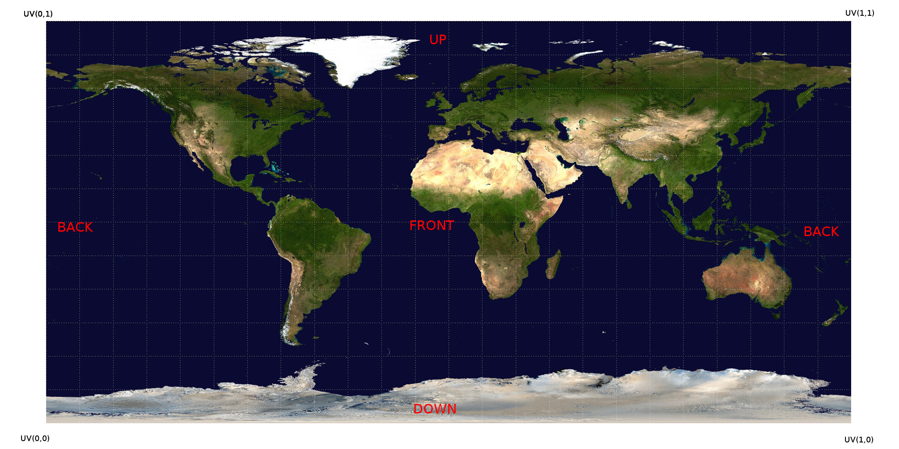

Retinad Javascript plugin
===================================================

## How to use

### Installation

* `npm install retinadjs`
* include **node_modules/retinadjs/dist/retinad.min.js** in the **index.html** of the project

### Use
1. Connect: (Mandatory first step)
    * `retinad.connect({appId: RETINAD_APP_ID, accountKey: RETINAD_ACCOUNT_KEY})`
    * **RETINAD_APP_ID** and **RETINAD_ACCOUNT_KEY** are the App ID and the Account Key that has been sent by email.

2. Set context name: (Mandatory step)
    * `retinad.setContextName(name)`
    * Usually, **name** would correspond to the name of the video file, or a unique name to identify it easily.
    * Call this function at the start of all videos. Don't forget to call this function at the beginning of the session as well.

3. Play: (Mandatory step)
    * `retinad.play({u: currentU, v: currentV}, currentTime)`
    * **currentU** and **currentV** are the coordinates of the current camera position, in the UV coordinates system. Please see Coordinates section for more details.
    * **currentTime** corresponds to the playback time in seconds.
    * Call this function when a video begins to play -- this includes when the user presses play or when a video auto-plays.

4. Collect data: (Must be called at each frame)
    * `retinad.collectData({u: currentU, v: currentV}, currentTime)`

5. Pause:
    * `retinad.pause({u: currentU, v: currentV}, currentTime)`
    * Call this function when a video is paused.

6. Stop: (Must be called at the very end of the session)
    * `retinad.stop({u: currentU, v: currentV}, currentTime)`

### Coordinates (UV)

The orientation of the camera needs to be transposed to a UV format (Mercator Projection). Let's unwrap the video sphere:

The lower left corner is U = 0 and V = 0. The upper right corner is U = 1 and V = 1. The front is U = 0.5 and V = 0.5. U is the horizontal component and V is the vertical component.

Right now, only one public conversion function is available : `retinad_convertVector3ToUV({x: vectorX, y: vectorY, z: vectorZ})`. It assumes that the Vector3 is in the right-handed coordinates system.

## How to contribute

Fork this repository and post a pull request when everything is dandy!

### Development

* Run `npm install` before first use
* Use [browserify](https://github.com/substack/node-browserify) to compile the javascript to **dist/** by running `browserify retinad.js > dist/retinad.js`
* Run `npm run serve` to start a local server

### Good to know

* Frames are represented in tenths of seconds. For instance, for a playback time of 1.3 seconds, the frame number will be 13. Hundredths of seconds will be rounded to the nearest tenth of a second. A playback time of 1.25 will have a frame value of 13, while a playback time of 1.21 will have a frame value of 12.
